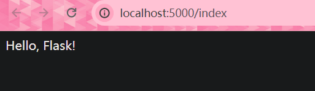
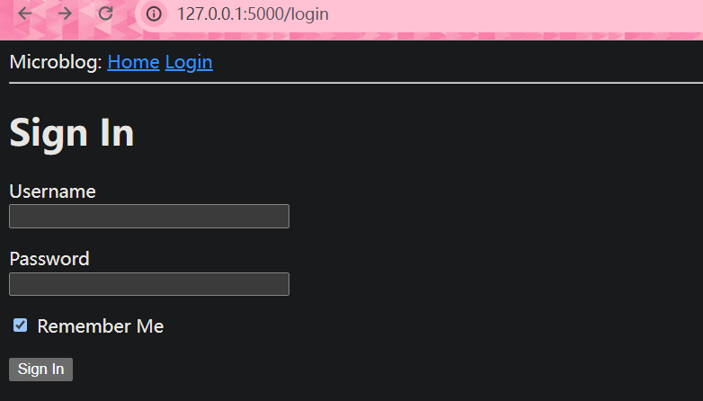
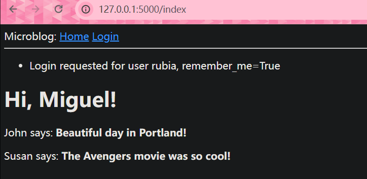
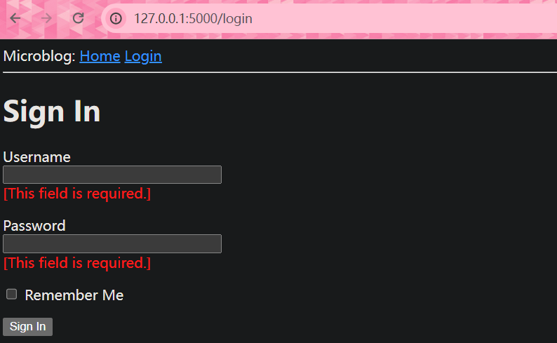

# 第一章 Hello，Flask！

## 创建项目

```bash
$ mkdir microblog
$ cd microblog
```

> 创建虚拟环境并激活

```bash
$ python -m venv venv
$ venv\Scripts\activate
```

> 安装Flask

```bash
$ pip install flask
```

## “Hello, Flask”应用

```py
# 创建app\__init__.py
from flask import Flask

app = Flask(__name__)

from app import routes
```

```python
# 创建app/routes.py
# 第二个app是__init__.py中实例化的对象
from app import app

@app.route('/')
@app.route('/index')
def index():
    return "Hello, Flask!"
```

```py
# 创建microblog.py
from app import app
```

现在整个文件为：

```txt
microblog/
  venv/
  app/
    __init__.py
    routes.py
  microblog.py
```

> 设置环境变量，定义Flask入口

```bash
$ set FLASK_APP=microblog.py
# 启动Flask
$ flask run
```

之后在http://localhost:5000/与http://localhost:5000/index能看到



## 设置环境变量

> 每次都要设置环境变量太麻烦，使用第三方包简化操作

```bash
$ pip install python-dotenv
```

```
# 创建.flaskenv
FLASK_APP=microblog.py
```

flask将寻找该文件并导入所有的环境变量

# 第二章 模板文件

> 开启debug，这样文件出现修改保存就会刷新

```py
# 修改microblog.py
from app import app

if __name__ == "__main__":
    app.run(debug=True)
```

这样就能通过`microblog.py`启动并开启debug了

## 什么是模板文件

先修改之前的`app/routes.py`文件，让他返回一段完整的HTML

```py
from app import app

@app.route('/')
@app.route('/index')
def index():
    user = {'username': 'Miguel'}
    return '''
<html>
    <head>
        <title>Home Page - Microblog</title>
    </head>
    <body>
        <h1>Hello, ''' + user['username'] + '''!</h1>
    </body>
</html>'''
```

> 每次都需要返回一大堆字符串太难以管理了，因此需要用到模板文件

首先创建`app\templates`文件夹

然后创建`app/templates/index.html`

```html
<!doctype html>
<html>
    <head>
        <title>{{ title }} - Microblog</title>
    </head>
    <body>
        <h1>Hello, {{ user.username }}!</h1>
    </body>
</html>
```

双花括号代表需要渲染的内容

现在重新修改`*app/routes.py`

```py
from flask import render_template
from app import app

@app.route('/')
@app.route('/index')
def index():
    user = {'username': 'Miguel'}
    return render_template('index.html', title='Home', user=user)
```

## 条件渲染

修改`app/templates/index.html`

```html
<!doctype html>
<html>
    <head>
        
        <title>{{ title }} - Microblog</title>
        
        <title>Welcome to Microblog!</title>
        
    </head>
    <body>
        <h1>Hello, {{ user.username }}!</h1>
    </body>
</html>
```

这样如果没有传入**title**就会使用**Welcome to Microblog!**作为标题

## 循环渲染

修改`app/templates/index.html`

```html
<!doctype html>
<html>
    <head>
        
        <title>{{ title }} - Microblog</title>
        
        <title>Welcome to Microblog</title>
        
    </head>
    <body>
        <h1>Hi, {{ user.username }}!</h1>
        
        <div><p>{{ post.author.username }} says: <b>{{ post.body }}</b></p></div>
        
    </body>
</html>
```

修改`*app/routes.py`

```py
from flask import render_template
from app import app

@app.route('/')
@app.route('/index')
def index():
    user = {'username': 'Miguel'}
    posts = [
        {
            'author': {'username': 'John'},
            'body': 'Beautiful day in Portland!'
        },
        {
            'author': {'username': 'Susan'},
            'body': 'The Avengers movie was so cool!'
        }
    ]
    return render_template('index.html', title='Home', user=user, posts=posts)
```

## 模板继承

> 对于重复利用的部件，使用模板继承重复利用

对于导航栏，这个部件需要重复利用，创建`app/templates/base.html`

```html
<!doctype html>
<html>
    <head>
      
      <title>{{ title }} - Microblog</title>
      
      <title>Welcome to Microblog</title>
      
    </head>
    <body>
        <div>Microblog: <a href="/index">Home</a></div>
        <hr>
        
    </body>
</html>
```

修改`app/templates/index.html`

```html



    <h1>Hi, {{ user.username }}!</h1>
    
    <div><p>{{ post.author.username }} says: <b>{{ post.body }}</b></p></div>
    

```

这样就将`index.html`中的内容插入了`base.html`中的块

# 第三章 表单

需要安装**flask-wtf**扩展处理表单

我们可以通过使用字典给**app实例**添加配置

```py
app = Flask(__name__)
app.config['SECRET_KEY'] = 'you-will-never-guess'
```

但是通常做法是在根目录创建一个`config.py`文件配置

```py
import os

class Config:
    SECRET_KEY = os.environ.get('SECRET_KEY') or 'you-will-never-guess'
```

然后在`app\__init__.py`中修改

```py
from flask import Flask
from config import Config

app = Flask(__name__)
app.config.from_object(Config)

from app import routes
```

这样就为web应用添加了一个秘钥

## 用户登入表单

首先创建一个`app\forms.py`

```python
from flask_wtf import FlaskForm
from wtforms import StringField, PasswordField, BooleanField, SubmitField
from wtforms.validators import DataRequired

class LoginForm(FlaskForm):
    # DataRequired()只验证填入内容是否为空，当然可以添加其他验证器
    username = StringField('Username', validators=[DataRequired()])
    password = PasswordField('Password', validators=[DataRequired()])
    remember_me = BooleanField('Remember Me')
    submit = SubmitField('Sign In')
```

## 表单模板文件

创建`app\templates\login.html`

```html



    <h1>Sign In</h1>
    <form action="" method="post" novalidate>
        {{ form.hidden_tag() }}
        <p>
            {{ form.username.label }}<br>
            {{ form.username(size=32) }}
        </p>
        <p>
            {{ form.password.label }}<br>
            {{ form.password(size=32) }}
        </p>
        <p>{{ form.remember_me() }} {{ form.remember_me.label }}</p>
        <p>{{ form.submit() }}</p>
    </form>

```

由于验证由后端完成，因此无需让前端验证

**form.hidden_tag（）**生成一个隐藏字段，其中包含一个用于保护表单免受CSRF攻击的令牌。要保护表单，只需包含此隐藏字段，并在Flask配置中定义SECRET_KEY变量。如果你处理好这两件事，Flask WTF会为你做剩下的事情。

## 表单界面

在`app\routes.py`添加下面的内容

```py
from flask import render_template
from app import app
from app.forms import LoginForm

# ...

@app.route('/login')
def login():
    form = LoginForm()
    return render_template('login.html', title='Sign In', form=form)
```

这样在http://localhost:5000/login就能看到



## 接收表单数据

当前如果点击提交按钮会显示方式 **"Method Not Allowed"**，是因为还没编写接收表单的逻辑

```python
from flask import render_template, flash, redirect

# 接收GET和POST请求，默认值接收GET
@app.route('/login', methods=['GET', 'POST'])
def login():
    form = LoginForm()
    # 当浏览器发送GET请求获取表单页面时返回False，这样就跳过了if逻辑，返回了表单界面
    # form.validate_on_submit()会对用户提交的表单进行收集验证，如果全部符合则返回True并重定向index界面
    # 如果有不符合则返回False并刷新界面
    if form.validate_on_submit():
        # flash()方法会储存这条信息
        flash('Login requested for user {}, remember_me={}'.format(
            form.username.data, form.remember_me.data))
        return redirect('/index')
    return render_template('login.html', title='Sign In', form=form)
```

修改`app\templates\base.html`显示flash消息

```html
<html>
    <head>
        
        <title>{{ title }} - microblog</title>
        
        <title>microblog</title>
        
    </head>
    <body>
        <div>
            Microblog:
            <a href="/index">Home</a>
            <a href="/login">Login</a>
        </div>
        <hr>
        <!-- 获取flash消息 -->
        
        
        <ul>
            
            <li>{{ message }}</li>
            
        </ul>
        
        
        
    </body>
</html>
```

这样登入后就会在主页面看到



当使用**get_flashed_messages()**请求一次后，消息就会被删除

## 改进表单验证

首先对页面`app/templates/login.html`进行修改，让用户知道自己输入了错误的数据

```html



    <h1>Sign In</h1>
    <form action="" method="post" novalidate>
        {{ form.hidden_tag() }}
        <p>
            {{ form.username.label }}<br>
            {{ form.username(size=32) }}<br>
            
            <span style="color: red;">[{{ error }}]</span>
            
        </p>
        <p>
            {{ form.password.label }}<br>
            {{ form.password(size=32) }}<br>
            
            <span style="color: red;">[{{ error }}]</span>
            
        </p>
        <p>{{ form.remember_me() }} {{ form.remember_me.label }}</p>
        <p>{{ form.submit() }}</p>
    </form>

```

这样在出错时就会显示



对于导航栏和重定向功能，目前虽然效果完美，但是目前是直接编写的链接，对于后期维护不利，因此替换`app/templates/base.html`中的

```html
        <div>
            Microblog:
            <a href="{{ url_for('index') }}">Home</a>
            <a href="{{ url_for('login') }}">Login</a>
        </div>
```

修改`app/routes.py`

```python
from flask import render_template, flash, redirect, url_for

# ...

@app.route('/login', methods=['GET', 'POST'])
def login():
    form = LoginForm()
    if form.validate_on_submit():
        # ...
        return redirect(url_for('index'))
    # ...
```
